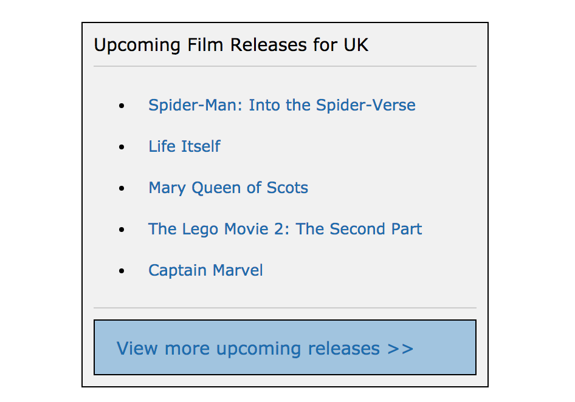
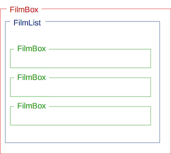
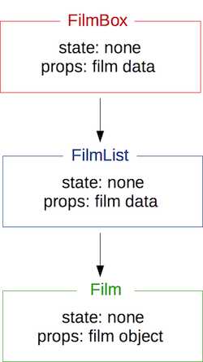

# React: Film Releases

## Reading

Thinking In React (20 mins) https://facebook.github.io/react/docs/thinking-in-react.html

## Practice

You task is to plan and build an application that displays a list of upcoming film titles, each one linking to their [imdb](https://www.imdb.com/) page.


_Screenshot of example result_

- Draw out the UI on paper, breaking it down into components. :white_check_mark:
>


- Draw a component hierarchy diagram, noting down any state and props for each component. :white_check_mark:
>


- Implement the application in React. :white_check_mark:

Note: The 'View more upcoming releases' button can link to the imdb calendar page - [https://www.imdb.com/calendar/?region=gb](https://www.imdb.com/calendar/?region=gb)

### Data

You can use the following data to display in your application:

```js
[
  {
    id: 1,
    name: "Avengers: Endgame",
    url: "https://www.imdb.com/title/tt4154796/?ref_=rlm"
  },
  {
    id: 2,
    name: "Tolkien",
    url: "https://www.imdb.com/title/tt3361792/?ref_=rlm"
  },
  {
    id: 3,
    name: "A Dog's Journey",
    url: "https://www.imdb.com/title/tt8385474/?ref_=rlm"
  },
  {
    id: 4,
    name: "Pokémon Detective Pikachu",
    url: "https://www.imdb.com/title/tt5884052/?ref_=rlm"
  },
  {
    id: 5,
    name: "Aladdin",
    url: "https://www.imdb.com/title/tt6139732/?ref_=rlm"
  }
]
```
